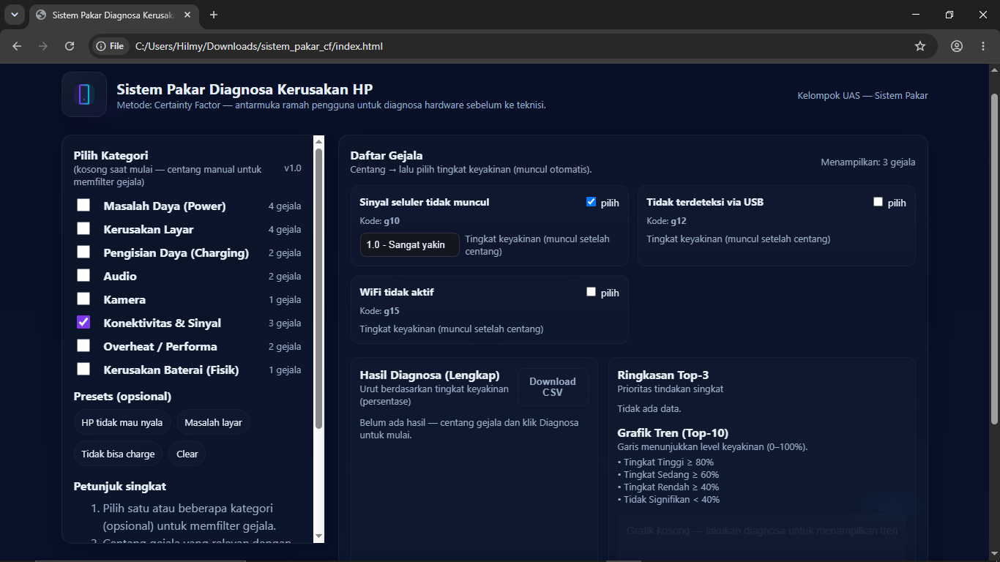
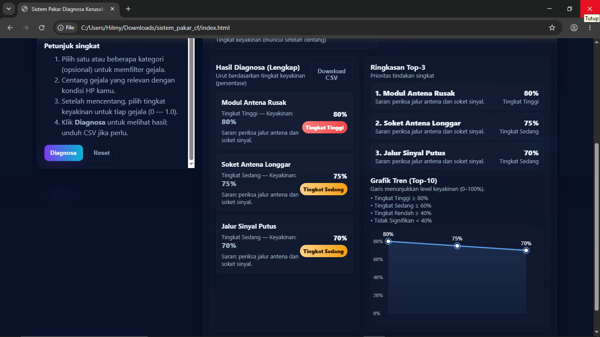

# Android Hardware Diagnosis Expert System


A web-based expert system that performs an initial diagnosis of Android hardware problems using the **Certainty Factor (CF)** method. Users select the symptoms they are experiencing, and the system estimates the most likely hardware failure along with its confidence level.

This project was developed as the final project for the **Expert System** course, Informatics Engineering, Faculty of Informatics, Bina Insani University (2026).

---

# Table of Contents

- [Overview](#overview)
- [Features](#features)
- [Demo](#demo)
- [Project Structure](#project-structure)
- [How the System Works](#how-the-system-works)
- [Technology Stack](#technology-stack)
- [Symptom Categories](#symptom-categories)
- [Limitations](#limitations)
- [Future Development](#future-development)
- [What I Learned](#what-i-learned)
- [References](#references)
- [License](#license)
- [Acknowledgment](#acknowledgment)

---

# Overview

Diagnosing smartphone hardware failures often requires technical knowledge and practical experience. This project aims to assist users by providing an initial diagnosis based on the symptoms they observe.

The system applies the **Certainty Factor (CF)** method, a reasoning technique commonly used in expert systems to represent uncertainty. Since one symptom can indicate multiple hardware failures with different confidence levels, the CF method combines expert knowledge with user confidence values to estimate the most probable diagnosis.

---

# Features

- Android hardware diagnosis based on selected symptoms
- Certainty Factor reasoning engine
- Knowledge base built from expert technician knowledge
- Confidence score calculation
- Top 3 diagnosis ranking
- Interactive diagnosis chart
- Responsive web interface
- Simple and intuitive user experience

---

# Demo

## Video

<video src="https://github.com/user-attachments/assets/4fff09f7-88b1-49d6-a01e-f98d98a1b824" controls="controls" style="max-width:100%;"></video>

## Screenshots

### Diagnosis Input



### Diagnosis Result



---

# Project Structure

```text
android-hardware-diagnosis-cf
│
├── docs
│   ├── input-diagnosa.png
│   └── hasil-diagnosa.png
│
├── index.html
├── inference.py
├── knowledge.py
├── README.md
├── LICENSE
└── .gitignore
```

---

# How the System Works

### 1. Symptom Input

Users select the symptoms they are experiencing and specify their confidence level for each symptom.

### 2. Knowledge Base

Each symptom is associated with one or more possible hardware failures. Every relationship has a Certainty Factor value defined by an experienced smartphone technician.

### 3. Inference Engine

The inference engine multiplies the user's confidence value by the expert CF value.

When multiple symptoms support the same diagnosis, the resulting CF values are combined using the standard Certainty Factor combination formula.

### 4. Diagnosis Result

The system calculates the confidence level for every possible hardware failure.

Results are:

- Ranked from highest to lowest confidence
- Displayed as Top 3 predictions
- Visualized with a chart
- Categorized into confidence levels

---

# Technology Stack

| Component | Technology |
|-----------|------------|
| Frontend | HTML, CSS, JavaScript |
| Inference Engine | Python |
| Reasoning Method | Certainty Factor |
| Knowledge Representation | Rule-Based Expert System |

---

# Symptom Categories

| Category | Example Symptoms |
|-----------|------------------|
| Power | Device does not respond to the power button, sudden shutdown, repeated restarts |
| Screen | Blank screen, display lines, cracked appearance, ghost touch |
| Charging | Device will not charge, USB not detected |
| Audio | No sound output, low speaker volume |
| Camera | Blurry photos, camera fails to open |
| Connectivity | No cellular signal, Wi-Fi cannot be enabled |
| Overheating | Device overheats, abnormal IC behavior |
| Battery | Swollen battery |

---

# Limitations

- The knowledge base is based on the experience of a single smartphone repair technician.
- Confidence values are expert estimates rather than statistically validated probabilities.
- Only predefined symptoms can be diagnosed.
- The system depends on accurate symptom input from users.
- The knowledge base does not update automatically.
- The web interface and Python inference engine are maintained separately.

---

# Future Development

Possible improvements include:

- Expand the knowledge base with additional symptoms and hardware failures.
- Validate Certainty Factor values using multiple experts.
- Integrate the Python inference engine into a unified backend.
- Add image-based diagnosis support.
- Compare Certainty Factor with alternative reasoning methods such as Fuzzy Logic or Bayesian approaches.
- Develop a mobile version of the application.

---

# What I Learned

This project helped me gain practical experience in:

- Designing rule-based expert systems
- Applying the Certainty Factor method
- Building an inference engine
- Representing expert knowledge programmatically
- Developing interactive web applications
- Writing technical documentation
- Translating real-world expertise into software logic

---

# References

- Nugrahani, K. N. (2024). *Sistem Pakar Diagnosa Kerusakan Smartphone Android Dengan Metode Certainty Factor Berbasis Web*. Universitas Duta Bangsa Surakarta.

- Nengsih, Y. G. (2020). *Sistem Pakar Menggunakan Forward Chaining dan Certainty Factor untuk Diagnosa Kerusakan Smartphone*. JURSIMA, 8(2), 21–30.

---

# License

This project is licensed under the MIT License.

See the [LICENSE](LICENSE) file for details.

---

# Acknowledgment

Special thanks to the professional smartphone repair technician who generously shared the domain knowledge used to build the knowledge base and Certainty Factor rules implemented in this project.

---

## Team

- Muhammad Hilmy Al-dzakwan
- Andrean Yudi Utomo
- Hafidz Zaman
- Adjly Vellian Qianu
